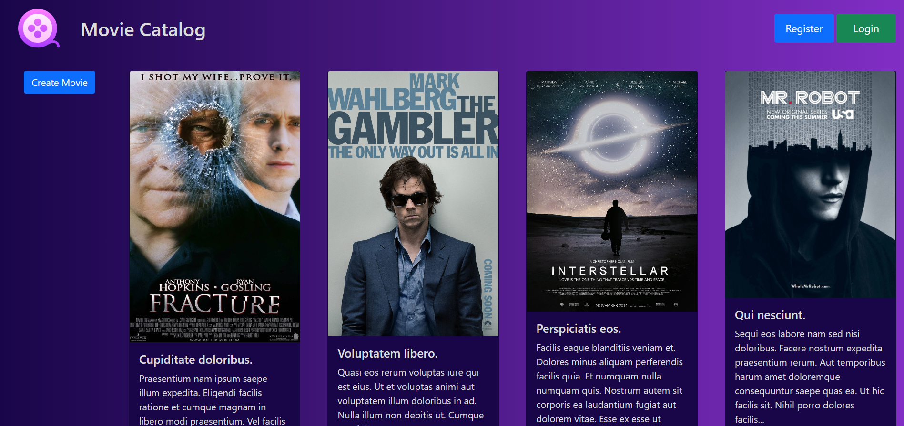
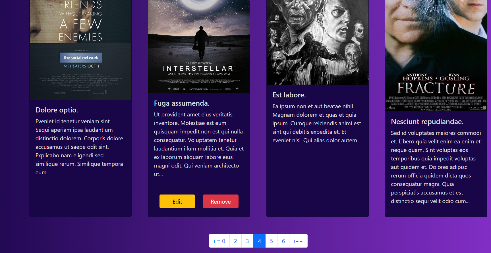
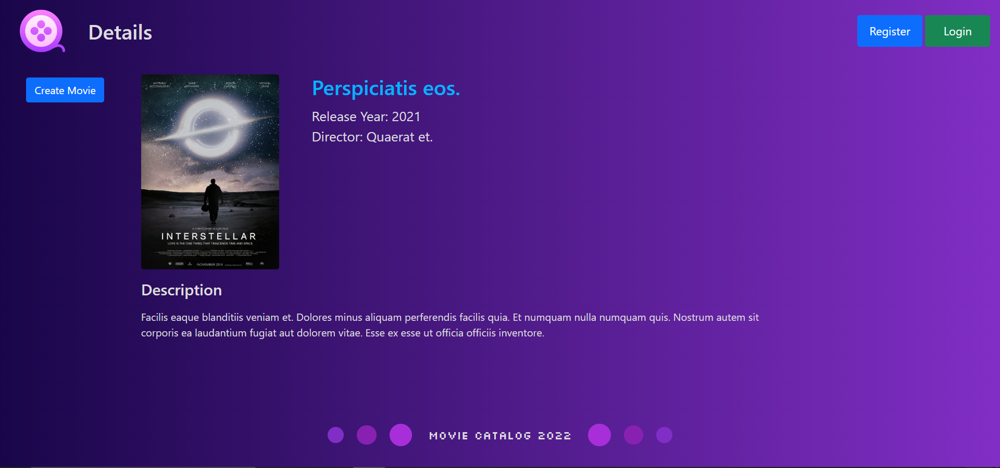
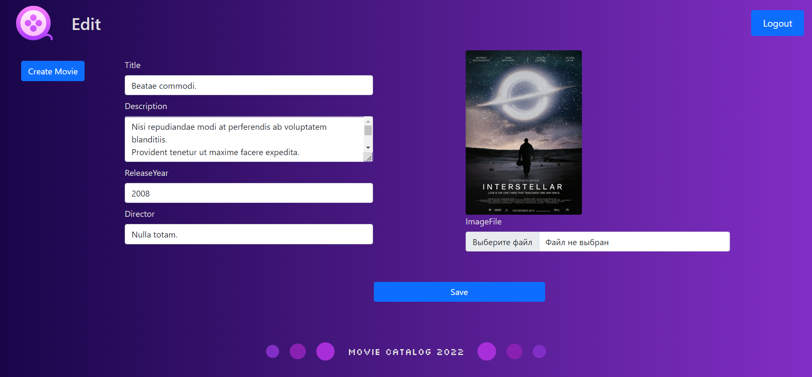

# Movie Catalog

Тестовое задание.

### Описание
Необходимо создать сайт, который представляет из себя каталог фильмов. На сайте должны быть страницы: 
 - списка всех фильмов (с пагинацией);
 - страница одного отдельного фильма;
 - страница редактирования данных о фильме;
 - страница создания нового фильма. 

Редактировать фильм имеет право только тот, кто изначально выложил информацию об этом фильме. Для каждого фильма хранятся: название, описание, год выпуска, режиссёр, пользователь, который выложил информацию, постер. Постер - это файл-изображение. Должна быть возможность загрузить этот файл на сервер и посмотреть его на странице детальной информации о фильме. Функциональность по выкладыванию видео-файла фильма не нужна, нужна только информация о нём. При реализации учитывать, что фильмов в каталоге может быть потенциально сотни тысяч.

### Требования

Ко внешнему виду требования минимальные, но всё должно выглядеть аккуратно и приятно. Необходимо использовать Bootstrap. На бекенде должны быть Asp.Net Core и паттерн MVC, Asp.Net Identity и Entity Framework Core. Не нужно использовать классический .Net Framework, только .Net Core. В решении не подразумевается использование Angular, React, Vue. В остальном допустимо использовать любые сторонние библиотеки, в том числе nuget-пакеты. Не нужно самим реализовывать функциональность библиотек, если это не оправдано какими-то ограничениями.

## Docker
1. Execute in root directory.

    ```
    docker-compose up --build -d 
    ```
2. Open http://localhost:5000.

## Techical Stack

- C# 10
- ASP.NET 6.0 MVC
 - ASP.NET Identity
- .NET Core Native DI
- Entity Framework Core 6.0
- PostgreSQL
- xUnit
- AutoMapper

UI
- Bootstrap 5
- CSS Grid

## Practices

- Clean Architecture
- Repository & Generic Repository
- Specification Pattern
- Unit Of Work
- Inversion of Control / Dependency injection
- ORM

## Web screens

<p align="center">
    
</p>

<p align="center">
    
</p>

<p align="center">
    
</p>

<p align="center">
    
</p>

<p align="center">
    
</p>