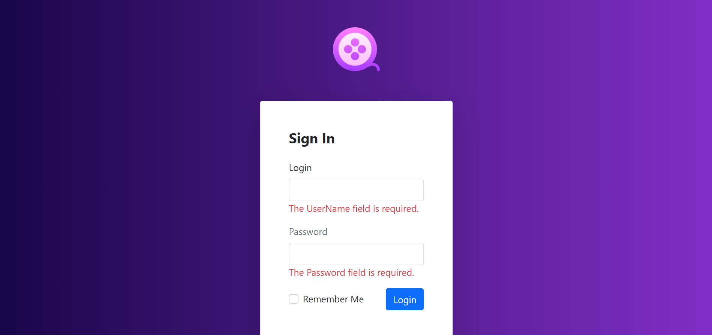

# Movie Catalog

Movie Catalog.

## Docker
1. Execute in root directory.

    ```
    docker-compose up --build -d 
    ```
2. Open http://localhost:3000.

## Techical Stack

- C# 10
- ASP.NET 6.0 MVC
 - ASP.NET Identity
- .NET Core Native DI
- Entity Framework Core 6.0
- PostgreSQL
- xUnit
- AutoMapper

UI
- Bootstrap 5
- CSS Grid

## Practices

- Clean Architecture
- Repository & Generic Repository
- Specification Pattern
- Unit Of Work
- Inversion of Control / Dependency injection
- ORM

## Web screens

<p align="center">
    
</p>

<p align="center">
    
</p>

<p align="center">
    
</p>

<p align="center">
    
</p>

<p align="center">
    
</p>